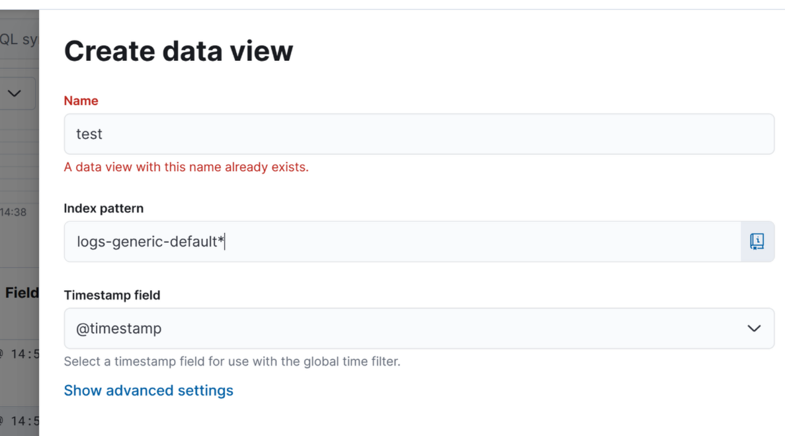
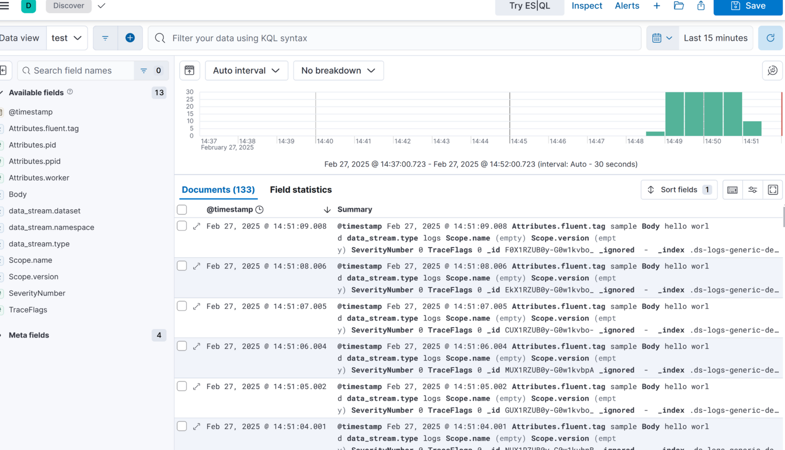

# OpenTelemetry Collector Fluent Forward Sample

```
docker-compose up
```

Then, visit [http://localhost:5601/app/discover#/](http://localhost:5601/app/discover#/) to see the logs in Kibana.

Create a new data view:

- Specify the index pattern: `logs-generic-default*`



